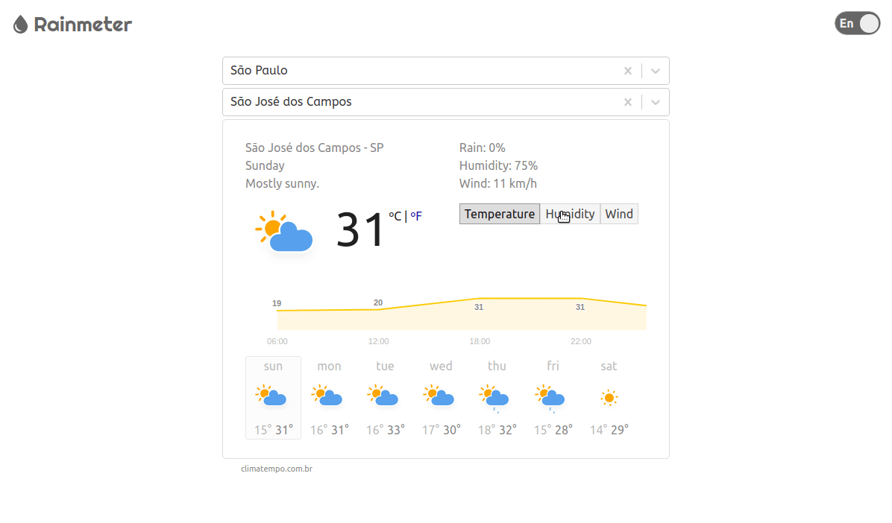

# Rainmeter


Rainmeter is a weather forecast app which has the focus on show rainy days foreseen.

This is side project and was inspired on Google Weather web app.

<p align="center">
  
</p>

## Running

Run app
```
yarn install && yarn start
```

Run tests

```
yarn test
```

Run all tests with coverage

```
yarn test --coverage --watchAll=false
```
